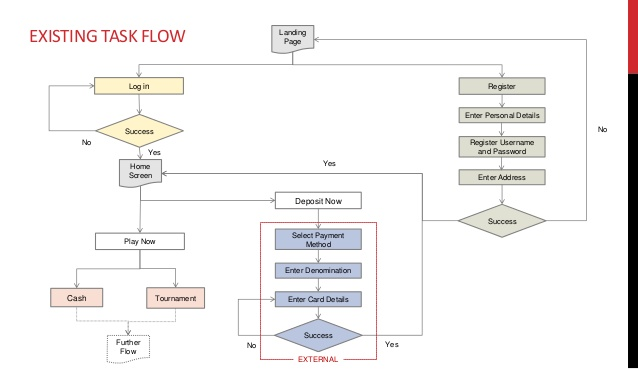

# coding-coach

Connecting developers with mentors worldwide.

## UX DESIGN

### How to submit your contribution

**CLI:**
Follow instructions in `dev` branch for cloning the entire repo and familiarize yourself with guidelines for contributing.

Make sure you make all your design contributions in the design branch:
`$ git checkout design`

**Direct Upload and Edit:**
You can also upload and edit design files directly in your forked branch with the tabs above. You will still need to create a pull request to merge your changes with the main `design` branch.

**Process:**
Use [draw.io](https://www.draw.io/) for creating diagrams, save them to your Google Drive and set the sharing to 'Anyone with the link can comment'. Save your diagram locally as `.jpg` and move it to `jpg` folder in this branch.

Add your design to `UX/README.md` with a descriptive title (ex. SignIn), a link to your original diagram, and the `.jpg` image of your diagram.

Cheatsheet for `.md` syntax [here](https://github.com/adam-p/markdown-here/wiki/Markdown-Cheatsheet).

#### NOTE: PRs

Create pull requests from your local repository directly with `design` branch, not with `dev` branch. Pull requests in this branch should not be merged with development.

#### Example of a task flow diagram

#### Report Abuse flow diagram

