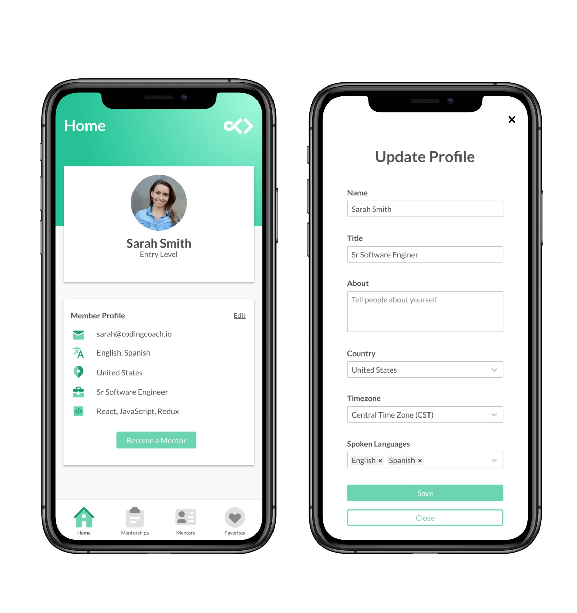
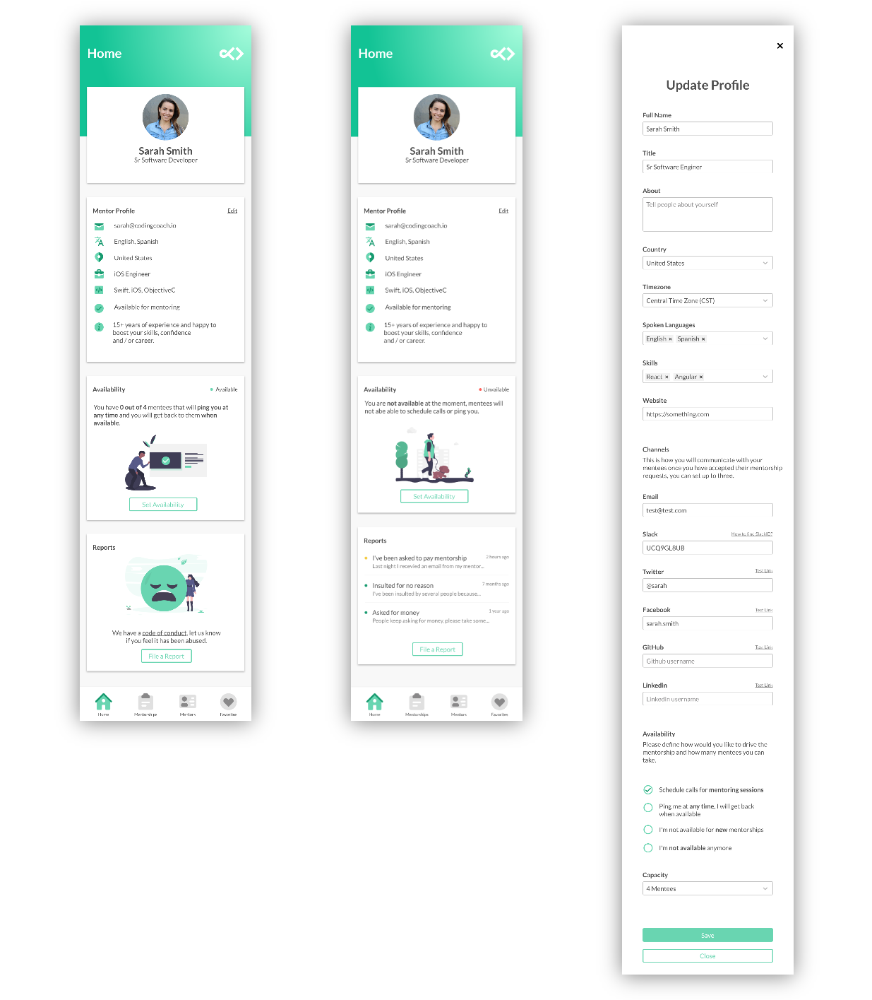

Over the last couple weeks we've been working on the new features we want to implement in the platform. We've finally came up with a plan for the improvements we will be working over the next couple months.

While this is not set on stone, it'll definitely give us the direction we need to keep this project moving forward. I'm really excited about the new things to come and I hope all of you can join us on this adventure.

One of the goals is to deliver features as quickly as we can, for that reason we are going to release all-new features incrementally. We are planning to have four small/medium releases over the next several months.

### Release 1: User profiles
At the moment mentees can't really do anything in the platform, but it would be great if any user can update their profile so mentors can see their goals and expectations when a mentee reaches out to them.

For this first release, we are going to create a new private area for members, the profile page will look like this, from here members can update their profile.

We will allow members to update their avatar as well. For now, there will be only two options in the main navigation menu, `Home` and `Mentors`.

The Home link will redirect the user to the profile, later on we want to show several widgets here to provider mentors and mentees with useful information about their mentorships.

The Mentors link will send users to the current app we have, from there people will be able to search for mentors.

### Release 2: Mentor availability and reports
On top of the user profile, we are going to build the mentor profile page, the design is the same but there will be more fields, as mentors can define communication channels and availability.

We are also planning to build an easy way to report any issues in the mentorships by creating a new reports module. Mentors and mentees will be able to report missconducts and reach out to Coding Coach stuff.

### Release 3: Apply for mentorships
One of the problems we currently have is that mentorships are happening outside the platform, a mentee will reach out to a mentor and ask for help, but then we don't know if that relationship is successfull or not.

This is the largest release in the roadmap, because we need to introduce a new process to make the mentorships happen in the platform, this way we are preparing the platform for new features we want to include later on.

In the new process a mentee will apply for a mentorship, by setting their goals and expectaions. All the applications will appear to the mentor in the new mentorships module. 

From there the mentor will be able to review the goals and decide if this is a good fit for both parties, then the mentor will be able to approve or reject the application.

Finally if the mentorship gets accepted, the mentee will be able to see the communication channels as well as some other details on the mentorship.

We have more ideas and plans to help mentors and mentees to succeed in the relationship and we believe this is the fundation we need to build everything on top of this.

### Release 4: Notes and finishing a mentorship
As a mentor myself I like to keep track of my mentees by keeping some notes, this is very useful especially at the beginning. We will work on introducing a feature to keep notes directly on the mentorship, this way it will be easier for a mentor to keep everything in a single place.

We also know that it's ok to terminate a mentorhip, for whatever reason this is, we want to allow mentors and mentees to terminate the relationship at any time, that's why we are going to introduce an easy way to terminate the mentorship and leaving feedback to the mentor and to the Coding Coach stuff.

### Asking for help
Today I was asked by a mentee who recently join the community:

> Why did you guys decided to help people like us(mentees)? You decided to give us a little bit of your time and share knowledge with us. You might not know how valuable your advices are to us, but It's as valuable as gold, even more. I'm just curious about what motivate mentors like you?.

My answer was something like this:

> well... we all been there, we know first hand what's like to start learning something new, it's a bit intimidating and in my case I enjoy helping people, it makes me really happy 😁

I'm sure all our mentors agree that it really brings joy to help people, real joy, one that money can't buy. And at least that's one of the things that motivates me to work on this project.

We have several plans and ideas, but we need your help! We all have jobs and families, time is very limited for everyone in the team. But we have a mission, we want to impact as many lives as possible by helping them succeed in ther careers.

You are more than welcome to join the development team or become a patron, feel free to help in any way you can!
