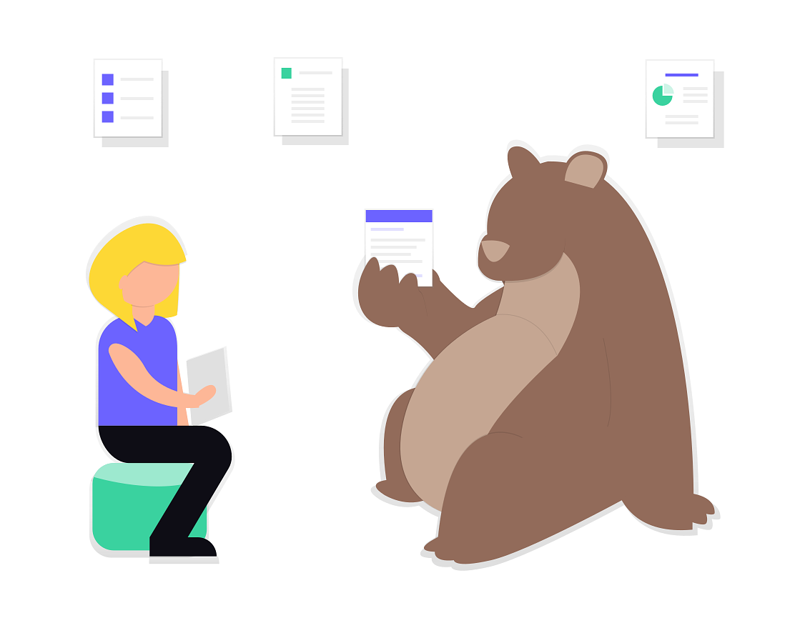
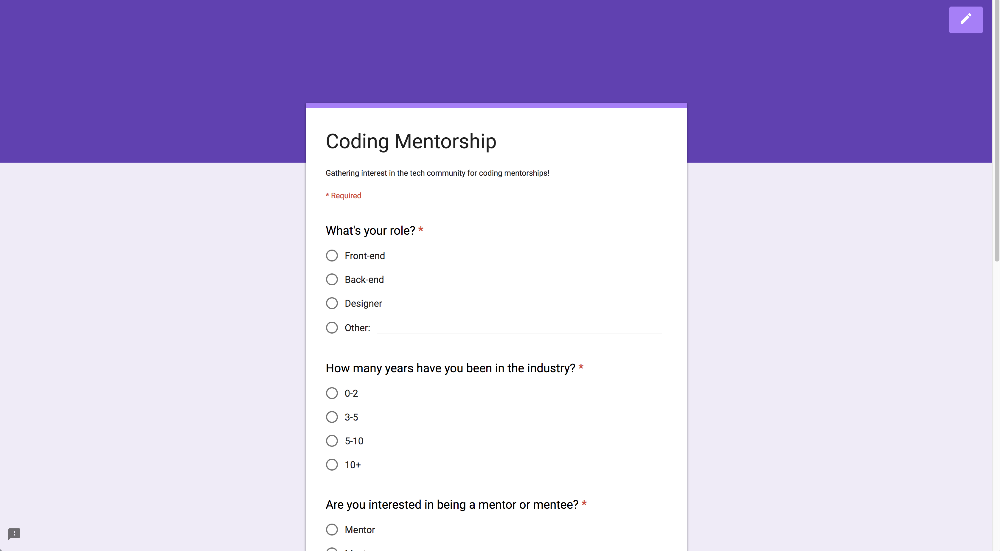
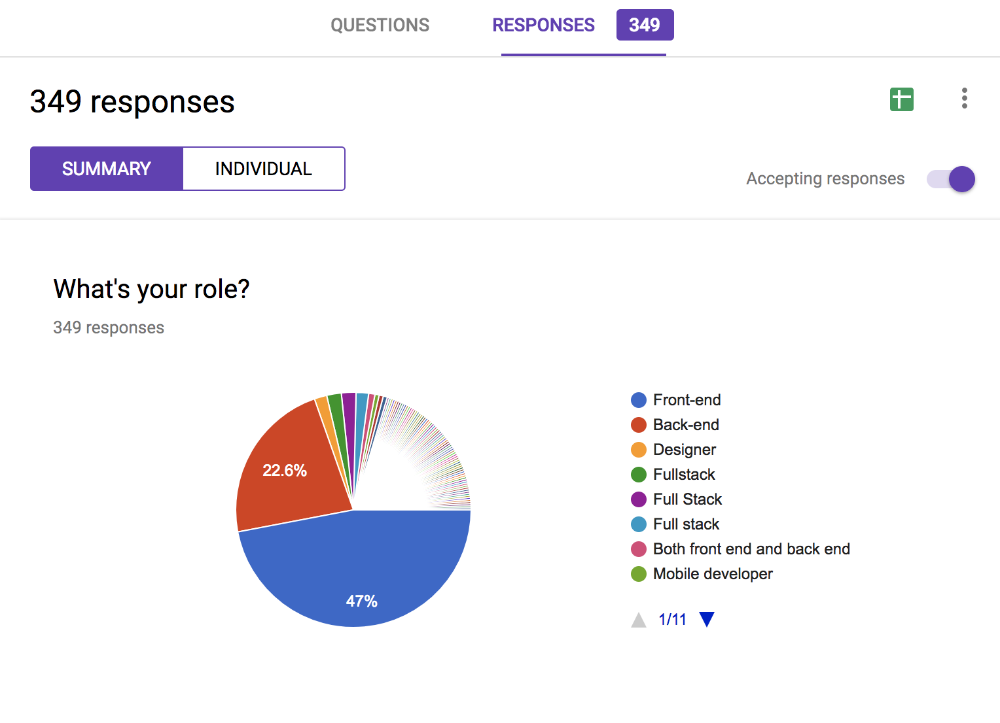
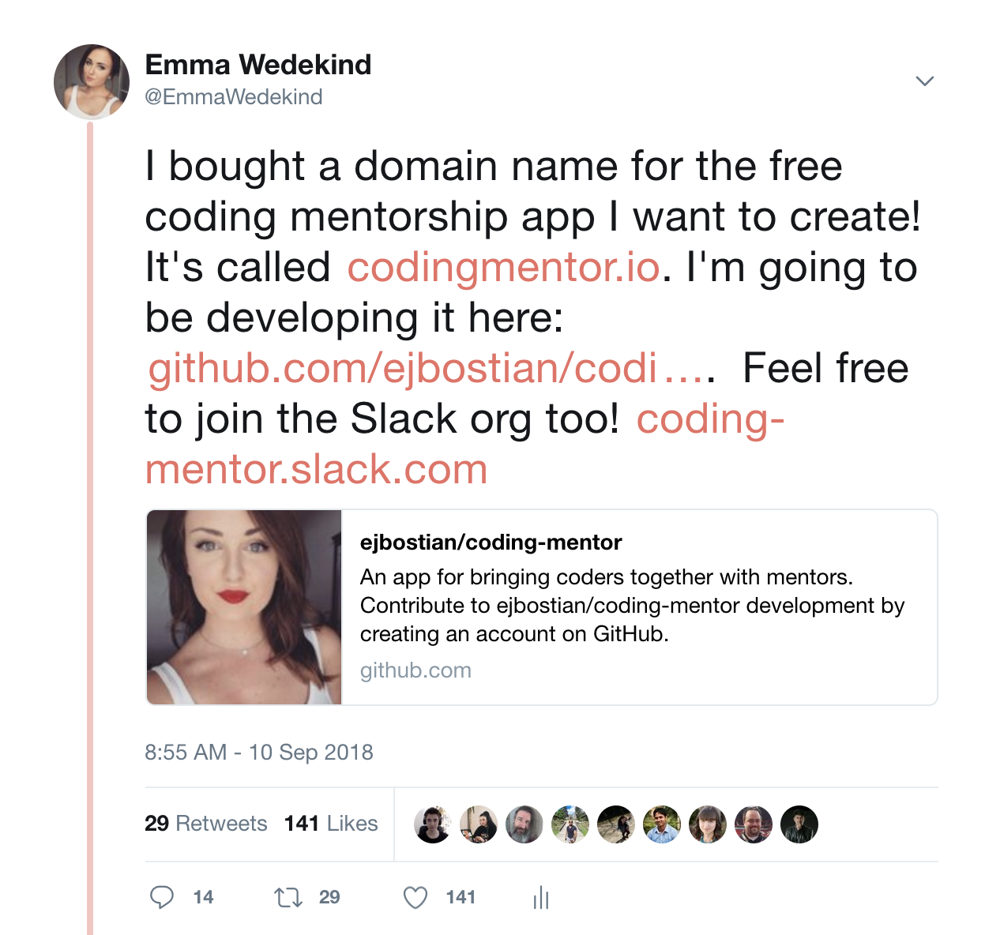
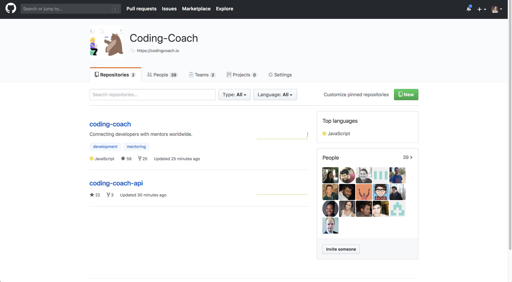
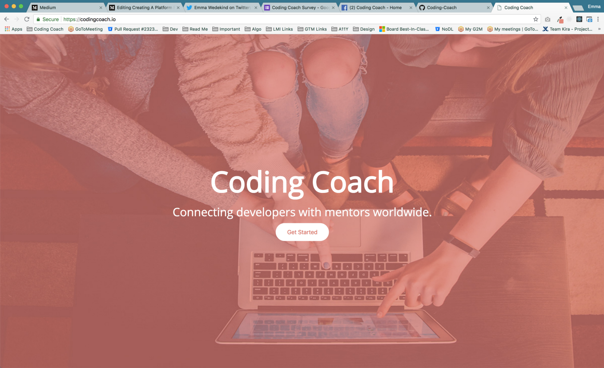

My entire career, I have been a proponent of mentorship. It can provide an invaluable platform from which developers can share knowledge about technology as well as their careers.

Yet I quickly realized that there was no application which was able to fill this huge need.

Although there are a few platforms which can be leveraged for mentorship, they all required payment to some extent.

Mentorship should be available to everyone, regardless of circumstance, but many developers don’t have access to a mentor, or can’t afford to pay for one.

I feel as though it is my responsibility to society to help facilitate the creation of an application which will allow any developer to find a mentor.

Thus, I created Coding Coach.

## Goal
The ultimate goal of Coding Coach is to build a mentorship application which allows developers to connect with mentors worldwide and grow their skillset.

I wanted Coding Coach to be open-source. This is an issue the community is extremely passionate to help remediate, so I established this project to be a community effort.

## Phase 1: Organization
### Gauge Interest
First, I created a Google survey to get a read on where people stand in the development community, and what they would be looking for.

I have received over 300 responses.

### Grab A Domain Name
I immediately knew I had to grab a domain name. Of course all the domains surrounding mentorship have been taken, so I selected Coding Coach. I thought the alliteration had nice ring. Ultimately I would like to find a snazzier name, but this isn’t my top priority at the moment.

### Set Up Slack
Next, I set up a Slack organization under the same namespace (Coding-Coach). I created several channels to get the ball rolling:

* Front-end
* Back-end
* Design
* Documentation

### Set Up Social Media Accounts
I immediately created a [Twitter](https://twitter.com/codingcoach_io) and a [Facebook page](https://www.facebook.com/codingcoachio/) for the app. These will come in handy later on.

### Invite The Community
I immediately posted to Twitter asking for people to join the Slack organization if they’re interested in being part of the journey.

We now have over 250 members.

### Set Up A GitHub
I set up a GitHub organization with front-end and api repositories. I then added members who wanted to collaborate.

## Build A Landing Page
Next, I threw together a quick landing page design and built it using React’s `create-react-app`.

### Define Mission Statement
I knew I needed a mission statement for Coding Coach, so I set one up in Google Drive. I’m hoping to have this released by this Friday (September 14th, 2018)

### Define MVP 0 & Information Architecture
I also knew we had to define MVP 0 and the architecture for the application. I created two Google documents and the Coding Coach team is collaborating together to define a minimum viable product.

These documents are a work in progress, but it’s so cool to see how the community is so invested in building an amazing product.

### Define The Project Roadmap
Finally, I wanted to have a vision on where this project could take us, so I’ve defined an outline for the project. This is also a work in progress, but it’s good to have a tentative outline so you have a solid goal to work towards.

### Agree On A Tech Stack
Fortunately, my awesome team put together a Google document to keep track of the tech stack. We all agree to keep the app as simple as possible for the time being.

We chose to use these technologies on the front-end:

* React
* Redux (State management)
* Scss (Styling)
* Apollo (Data fetching)
* React i18next (Internationalization)
* React helmet (SEO)
* Circle CI (Continuous integration)
* Prettier (Code formatting)

These may change a bit as we get into development, but I’d say that’s a solid start.

### Outline Styles
I threw together some basic styling that would work for phase one. We’ve decided to use Figma for our design system as we progress. These styles will change drastically, but it’s a start.

### Set Up Trello Boards For Ideas
We set up Trello boards to keep track of ideas we had.

At the moment it’s just a way to keep track of all the great ideas floating around, but after MVP 0 is defined, we’ll set up stricter pipelines.

## Conclusion
I’d be lying if I said I wasn’t scared; I’m scared shitless. Mostly because I’m not used to being at the center of a project. But the Coding Coach Slack organization is full of incredible developers who I am so fortunate to work with.

I truly hope we can build something worthwhile to the development community, and perhaps even scale this to something larger.

This is just the beginning.