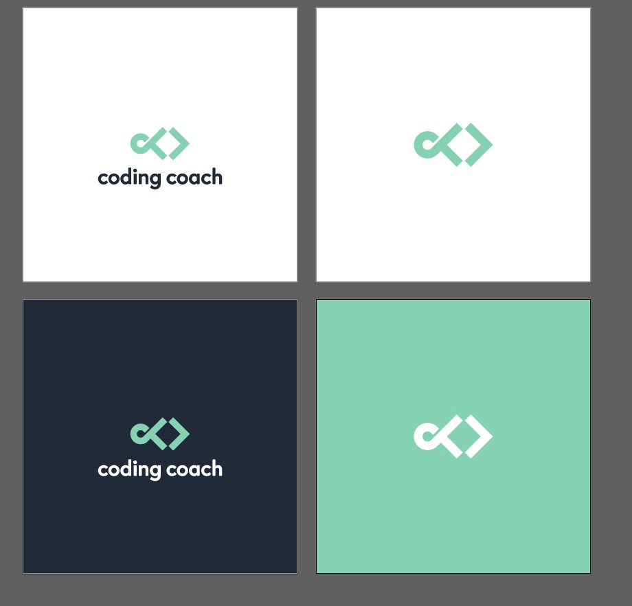

Many changes have been occurring for Coding Coach in the last several weeks. Development for the new and improved landing page is nearing an end and designs for user dashboards have begun! Below are some of the enhancements we’ve made and implemented over the last month.

### Terms & Conditions, Privacy Policy, & Cookies
The terms and conditions, privacy policy, and cookies documents have been created. Additionally, design for modals have been created. By leveraging components, we’re able to quickly implement new features.

### Log In & Sign Up
Designs for log in and sign up have been finalized. We wanted to keep the design simplistic and modern.

### Mobile-First Approach
During the development of the new landing page, we realized that we should be developing using a mobile-first approach. Mobile-first has many benefits, one of the main being performance, thus we transitioned our workflow to adopt this new approach.

### Mailing List
We’re in the process of creating a mailing list and email newsletter which will be sent to the participants of the Google survey. We hope to send updates as new features are delivered for Coding Coach.

### Re-usable Components
As we are developing the designs for Coding Coach, we’re implementing re-usable components which will allow us to have a more modular workflow. We’ve created buttons, inputs, and modals thus far.

### Logo Design
I decided that it was finally time to invest in a proper logo. So I logged on to Fiverr and found an awesome graphic artist. We’re in the final revision stage and hope to have our re-branding up soon!

### UX Design
I appointed a UX Lead: Lena Venable. She has been extremely helpful in regards to UX flows and put together the flow below. We’ve set up a design branch in our GitHub repo and will begin adding designs to our account.

### PayPal Donations
Lastly, I set up a business account for Coding Coach so we can begin to receive donations. Paying for the domains, hosting, and logo can add up so we’re hoping the community will be willing to support us!

### Conclusion
The product is slowly coming together. We hope to have version 2 of the landing page released soon!
Make sure to follow us on Twitter to keep up-to-date on the latest news!