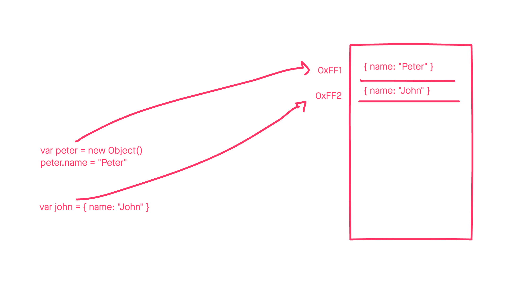
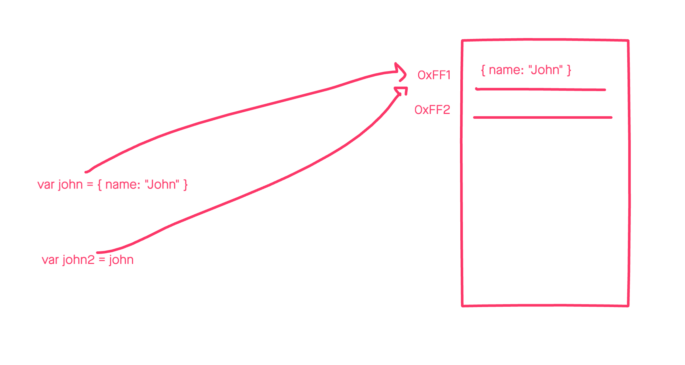
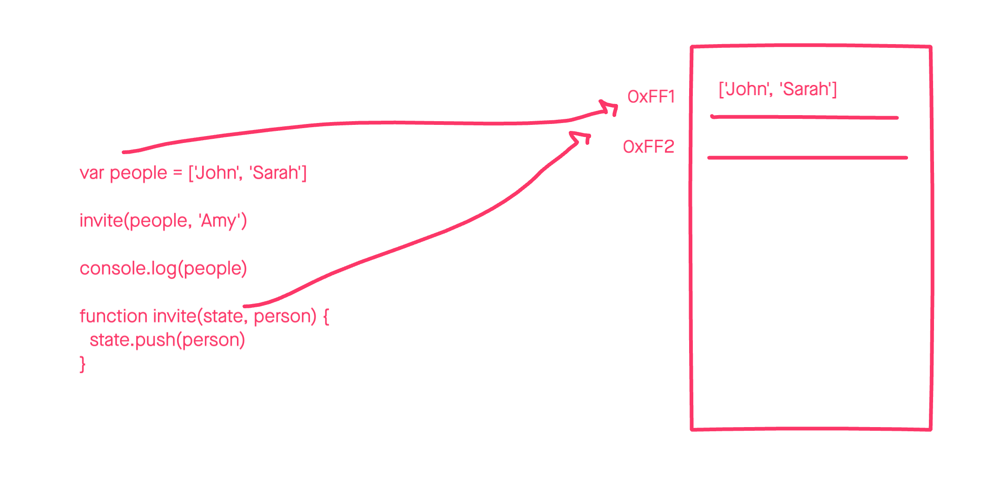

Let's start by a simple question, what's a reference? In simple words a reference is just a pointer to an address in memory.

When an app runs in your device, the OS will assign a memory stack to the program, we can use this stack to store any kind of data, such as objects, arrays, numbers and so on.

In JavaScript we can create objects using the `Object` constructor or just declaring inline objects.

```
var peter = new Object()
peter.name = 'Peter'

var john = { name: 'John' }
```

After the compiler runs these two lines, the memory stack will look like something like this.



There are two slots in the stack occupated by the new two objects we've created. And the only way we can access that data is through the two references we have: `peter` and `john`.

In this example `peter` points to `0xFF1` and `john` is pointing to `0xFF2`. As long as we don't overwrite the references, we can access the data in the memory and use it in any way we want.

Now let's consider the following scenario:

```
var john = { name: 'John' }
var john2 = john
```

We are creating a new reference that points to the same address as `john`, this doesn't mean we are duplicating the object in the memory stack, but rather just duplicating the reference.

The memory stack will look something like this:



Both `john` and `john2` will point to the same address that holds the object. What this means is that we can update the same object through any of the references, for example:

```
var john = { name: 'John' }
var john2 = john

john.lastname = 'Doe'

console.log(john2.lastname === john.lastname) // --> true
console.log(john2.lastname) // --> Doe
```

It's easy to get confused by this, one might think `john2` is duplicating the object and mutating the original will not affect the second one. But that's not the case as both are simple references to the same object.

This is a very important concept to understand, consider the following scenario:

```
var people = ['John', 'Sarah']

invite(people, 'Amy')

console.log(people) // <-- ['John', 'Sarah', 'Amy]

function invite(state, person) {
  state.push(person)
}
```

We are mutating the `state` array by adding a new element, but given that this param is just a reference, the `people` array gets updated as well.



And this is the reason to avoid mutating data, you might be updating data in places you might not want to. Libraries like react and redux advice not to mutate data when updating the state.

React uses the memory addresses to compare if an object has changed, therefore if you mutate the object react will not pick up the new changes and won't be able to trigger a re-render.

The same applies to redux, in order to find out if an objects was updated we need to create a new reference to the new object, for example:

```
var state = {
  people: ['John']
}

var newState = {
  ...state,
  people: [...state.people, 'Amy']
}

console.log(state.people === newState.people) // --> false
```

If you have any question or somethign was not very clear, just leave a comment below!


This tutorial is part of the [Leveling up your JavaScript skills](/blog/leveling-up-your-javascript-skills) series.