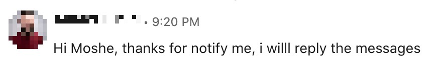
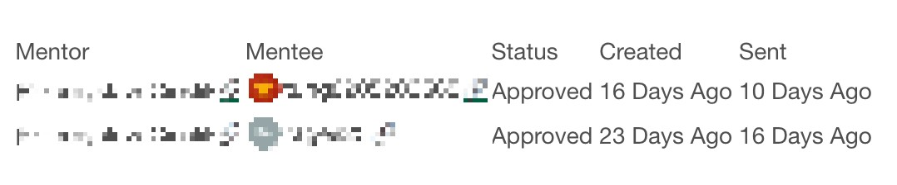
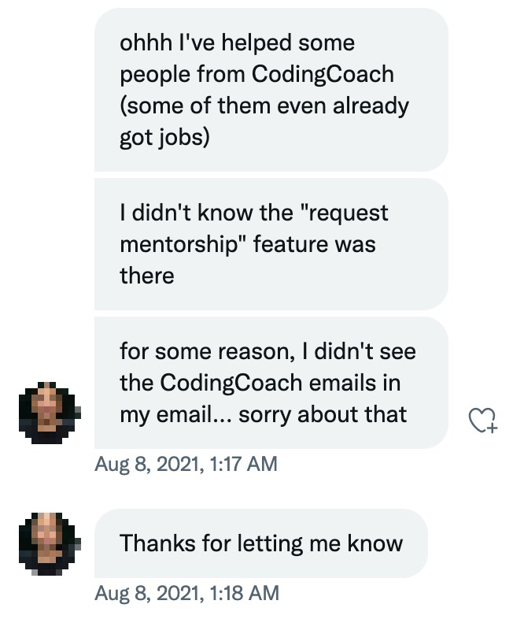

A couple of months ago we launched the new mentorship request process.

  <blockquote class="twitter-tweet" style="display: none">
A few days ago we launched the new mentorship request process 🥳 Big thanks for the great people who worked on it <a href="https://twitter.com/shayanypn?ref_src=twsrc%5Etfw">@shayanypn</a>, <a href="https://twitter.com/MooliMorano?ref_src=twsrc%5Etfw">@MooliMorano</a>, Chase Hochstrasser, <a href="https://twitter.com/Brent_m_Clark?ref_src=twsrc%5Etfw">@Brent_m_Clark</a> , <a href="https://twitter.com/moshfeu?ref_src=twsrc%5Etfw">@moshfeu</a>, <a href="https://twitter.com/crysfel?ref_src=twsrc%5Etfw">@crysfel</a>, Arun Kumar Mohan and Suemayah Eldursi 🙏<a href="https://twitter.com/hashtag/free?src=hash&amp;ref_src=twsrc%5Etfw">#free</a> <a href="https://twitter.com/hashtag/coding?src=hash&amp;ref_src=twsrc%5Etfw">#coding</a> <a href="https://twitter.com/hashtag/mentorship?src=hash&amp;ref_src=twsrc%5Etfw">#mentorship</a> <a href="https://t.co/gHWbVYIVH4">pic.twitter.com/gHWbVYIVH4</a>
&mdash; codingcoach (@codingcoach_io) <a href="https://twitter.com/codingcoach_io/status/1402377469005606918?ref_src=twsrc%5Etfw">June 8, 2021</a></blockquote>

We put a lot of thoughts and coding time into it and we are very happy about the results.

Since then, we received good feedback about it but then we started to receive feedback from mentors who'd prefer to keep the old process and they have very good reasons.

Now that we had some time to test our ideas, we think it's a good time to explain our motivation to change the process and the results.

**A reminder**: before the change, the mentors' channels were exposed so everyone could approach every mentor right away. So the old process was just to approach the mentor without us knowing anything about the request. Later on, we exposed the channels to CodingCoach members only.

## What was better in the old process?

- The direct way is shorter and clearer. In order to accept a request, mentors don't have to go the the mentors site
- When mentees approaching directly, their letters / messages are longer and more informative

## What didn't go well in the old process?

One of the goals of CodingCoach is to be as a reliable platform as possible. Makes sense, right?
Almost from day one, we received messages from mentees about them trying to connect mentors but the didn't hear back from them. We understood that some of the mentors are not active, maybe they never did.

So, we added a checkbox in the mentor's settings area to allow mentors to state whether they are available or not. Some of the mentors did update their availability but we kept getting more feedback about non responding mentors.
The situation was that we couldn't say who of the mentors is active and who is not.

## How it solved in the new process?

Now that we have the list of the requests and the mentor and mentee details, we can (and we do) approach the non responding mentors.

Some of them are indeed not responding, therefore we set them unavailable so mentees won't be able to contact them anymore (and disappointed).

Some of them respond that they don't have capacity to take mentees so we ask them to make themselves unavailable and decline the current requests.

But, surprisingly, some of them actually want and can be mentors but due technical issues or lack of attention, missed the requests.

We are so excited to see these mentors are taking new mentees following our inquiries 🥳
Here are some examples:

  

    
    <figure>
      
      <figcaption>Mentor approved requests after we sent a reminder</figcaption>
    </figure>
  

  

    
  

This is for non active mentors, right? What about non active mentees? Mentee who sends requests but disappears.
How is it possible? Well, some mentees send A LOT of requests so once they find a mentor, they are not responding to other mentors. As a start, we are about to [limit the allowed open requests to 5](https://github.com/Coding-Coach/find-a-mentor-api/issues/206).
In order to send more requests, they have to cancel an existing one. We're also planning to give (or encourage) mentees the option to cancel other requests they made once one of their requests  approved.

Another advantage of knowing the "mentorship relationships" is that it opens us a door to more features such as mentee recommendations, reputations, spotlights etc.

And last but not least, now both mentors and mentees have a full picture of all their mentors / mentees.

## Conclusion

- The new process gives us a better picture of the non responding mentors / mentees.
- It allows us to improve the way mentees approaching mentors (limit open requests, give a better way to skeleton mentorship requests) 
- It allows us to send reminders to the mentors
- It gives both mentors and mentees a full picture about their mentorship request / status.
- It opens a door for features like recommendations, reputations and more

## Final words

Running a volunteering system is not an easy task and we keep searching for the Golden Path.

We'd love (seriously, not figuratively!) to hear more feedback about ways we can improve this process and others.