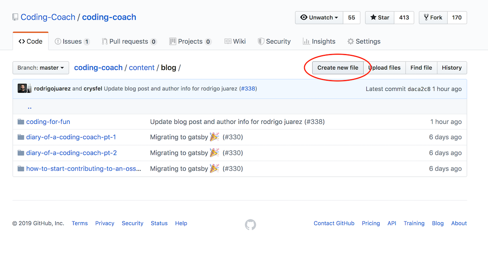
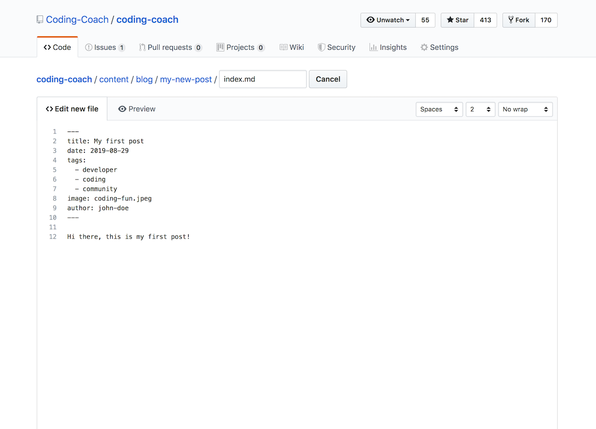
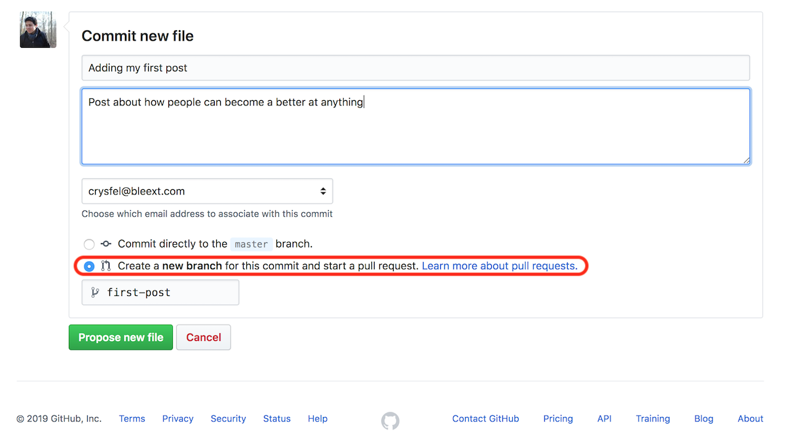

Over the last months we've been getting requests from different members to create a blog where everyone can participate and collaborate. 

Today I'm pleased to annouced our new blog! Where anyone can create a post through a GitHub PR! The idea is to have different topics such as mentoring, career growth, tutorials about technology, case studies and anything related to what Coding Coach stands for.

## How to publish
We are using Gatsby to power this site, therefore in order to publish a new post, we need to build and deploy a new version that includes the new content. This process is automated by Netlify when merging code into the `master` branch.

### Author Profile
The first thing you need to do is to create your author profile, we will display your avatar, description and a link to anywhere you want, you might use this link to promote your Coding Coach's mentor profile or personal site. You only need to do this once, all your posts will use the same information defined in this file.

To create a profile you need to create a new markdown file under [/content/authors](https://github.com/Coding-Coach/coding-coach/tree/master/content/authors), for example `/content/authors/john-doe.md`. In here you need to fill the following fields:

```markdown
---
name: Crysfel Villa
avatar: https://avatars2.githubusercontent.com/u/219207?s=460&v=4
link: https://mentors.codingcoach.io/?name=Crysfel+Villa
about: I love writing tutorials about JavaScript, Node, IoT, etc.
---
```

The fields are self explanatory, just replace the current values with your own information.

### Writing Content
Once your author profile is done, you need to create a new folder for your post under [/content/blog](https://github.com/Coding-Coach/coding-coach/tree/master/content/blog), for example `/content/blog/my-first-post`, the name of this folder should not contain any white space or non-alphanumeric values, because this will be part of the URL of your post.

Inside this folder you need need to add all the images you might want to show in your post as well as the post's content. For the content you will need to create an `index.md` file with the following fields at the top.

```markdown
---
title: Coding for fun for Coding Coach
date: 2019-04-29
tags: 
  - developer
  - coding
  - community
image: coding-fun.jpeg
author: rodrigo-juarez
---

This is the main content, you can *start writing* here :)
```

* The `title` field is the main post's title, you should consider naming the main folder same as the post's title here.
* The `date` field as the name sugested, is the published date, make sure to follow the format.
* The `tags` field is an array of strings, each string represents a tag. You should consider adding at least two tags and up to five.
* The `image` field is the main image for this post, we only support `jpg` and `png`. Try to set the dimentions to 1200x700 pixels, while this is not required try to use the same ratio.
* The `author` field corresponds to the author of this post, and in here you need to add the name of the file in the `authors` folder. Internally we will load that file and get the data to show it next to this post.

After you are done writing your article or tutorial, you will need to create a PR.

## Submit content for review
In order to publish a new post, the content needs to be reviewed by the community and published by one of Coding Coach admins. In the reviewing process we may ask you to rephrase something, clarify your point or even help you with some grammar. We will leave all the feedback in the pull request, GitHub is great for this process.

There are two ways to create a PR, cloning the project or using GitHub to write your content.

### Cloning the repo
If you don't want to use GitHub and instead use your favorite editor, you can [fork the repo](https://help.github.com/en/articles/fork-a-repo) in GitHub and [clone your fork](https://help.github.com/en/articles/cloning-a-repository). To run the project in your system, you just need to install the dependencies and run the dev server.

```bash
$ yarn install
$ yarn develop
```

Then open your browser in `http://localhost:8000` and you will see the app up and running! From here you will need to create a new folder in `content/blog` for your post and an author profile under `content/authors`.

As soon as you create these files you will start seeing your post in the blog.

After you are done, you will need to commit and push your changes. The create a PR in GitHub for the community to review your content.

```bash
$ git add .
$ git commit -m 'Somethign cool'
$ git push origin my-first-post
```

### Using GitHub to write
You don't need to clone the repo in order to publish an article, you can use GitHub to create the PR and write your content using the online editor.

The first thing you need to do is to open the [/content/blog](https://github.com/Coding-Coach/coding-coach/tree/master/content/blog) folder in your browser, then you need to click the `Create new file` button at the top right.



Set a name for the folder and markdown file, for example `my-new-post/index.md` (Don't forget to add the `/` between the folder and the markdown file). Remember that this will be part of the URL, therefore use only alphanumeric values. You will see the editor where you can start typing right away, there's a preview button you can use to see how everything is looking while you work on your post.



Once you are done writing your post, you need to save it or commit it. This is very simple, all you need to do is to scroll down all the way to the bottom of the page, add a title to your commit and a description, these fields are not required but is good to know what you did in case we want to see at the history.

Make sure to click into `Create a new branch for this commit...` option, and give it a name to your branch. This will allow you to better organize your all commits, or even come back at a later time and continue working on the same branch.



Finally you need to create a PR to submit your post for review. After clicking the `Propose new file`, GitHub will take you to a screen where you can create a PR, just follow the direction and you should be good to go.

Thank you for collaborating!
